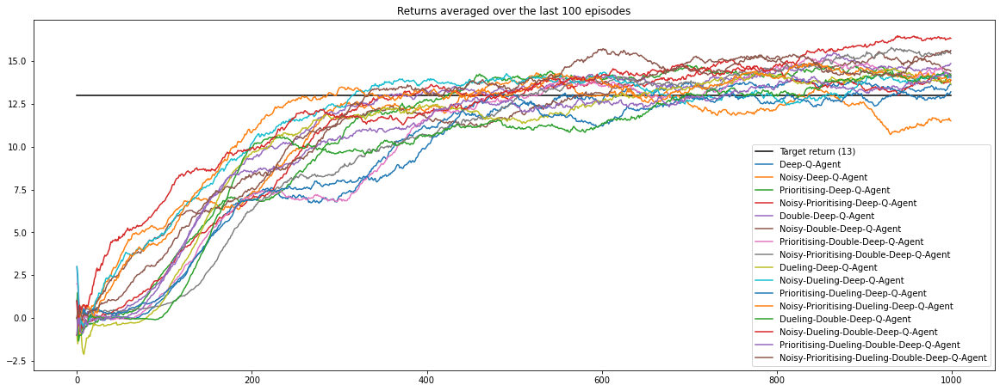

# Taste the Rainbow
### Collecting Bananas with 16 flavours of Deep Q-Learning

In this subproject, several agents are trained to collect bananas in a large, square world by using various forms of
__Deep-Q-Learning__.  
 

 

## The Environment

A reward of +1 is provided for collecting a yellow banana, and a reward of -1 is provided for collecting a blue banana. 
Thus, the goal of the agent is to collect as many yellow bananas as possible while avoiding blue bananas.

The state space has 37 dimensions and contains the agent's velocity, along with a ray-based perception of objects around 
the agent's forward direction. Given this information, the agent has to learn how to best select actions. Four discrete
 actions are available, corresponding to:

- **`0`** - move forward.  
- **`1`** - move backward.  
- **`2`** - turn left.  
- **`3`** - turn right.  

The task is episodic, and in order to consider the environment solved, the agent needs to achieve an __average score of 
+13 or higher over 100 consecutive episodes__.

## The Agents

Several agents have been trained and evaluated:

- __DeepQAgent__:  
   An agent using basic Q-learning with a Neural Network as estimator.  
   (Actually two Neural Networks: A main network and a delayed copy, the target network).  
   Read more about this [here](https://medium.com/@jonathan_hui/rl-dqn-deep-q-network-e207751f7ae4).
- __DoubleDeepQAgent__:  
   An agent using Double-Deep-Q-Learning as described [here](https://towardsdatascience.com/double-deep-q-networks-905dd8325412).
- __DuelingDeepQAgent__:  
   An agent utilizing Dueling-Q-Learning as desribed [here](https://towardsdatascience.com/dueling-deep-q-networks-81ffab672751).
- __DuelingDoubleDeepQAgent__:  
  This agent combines Double-Deep-Q-Learning with Dueling-Q-Learning.
  
Each one of those agents was trained with any of the following exploration-sampling-combinations:

-  __Epsilon-Greedy-Exploration__ + __Random Experience Replay__
- __Epsilon-Greedy-Exploration__ + __Prioritized Experience Replay__
- __Noisy Networks__ + __Random Experience Replay__
- __Noisy Networks__ + __Prioritized Experience Replay__.

More information on:
- [Prioritised Experience Replay](https://danieltakeshi.github.io/2019/07/14/per/)
- [Noisy Networks](https://arxiv.org/pdf/1706.10295.pdf)  
Disclaimer: For now, Noisy Networks have been implemented by adding random normal noise with exponentially 
   decreasing variance to each weight. The amount of degradation is configured through a parameter called
    alpha (see config.yml).

This sums up to 16 trained agents in total.

## Results

Over 1000 episodes of training, the following results have been achieved:

## Setup: Download the Unity Environment
For this subproject, you will not need to install Unity - the environment is pre-built and can be downloaded from one of 
the links below. You also need to perform the steps described in section "Getting Started" of the main README.md.

- Linux: [click here](https://s3-us-west-1.amazonaws.com/udacity-drlnd/P1/Banana/Banana_Linux.zip)
- Mac OSX: [click here](https://s3-us-west-1.amazonaws.com/udacity-drlnd/P1/Banana/Banana.app.zip)
- Windows (32-bit): [click here](https://s3-us-west-1.amazonaws.com/udacity-drlnd/P1/Banana/Banana_Windows_x86.zip)
- Windows (64-bit): [click here](https://s3-us-west-1.amazonaws.com/udacity-drlnd/P1/Banana/Banana_Windows_x86_64.zip)

Create the directory ./collecting_bananas/environment, place the unzipped content inside this folder and set the 
variable BANANA_PATH (defined in training.ipynb) as path to Banana.exe inside the environment 
folder.