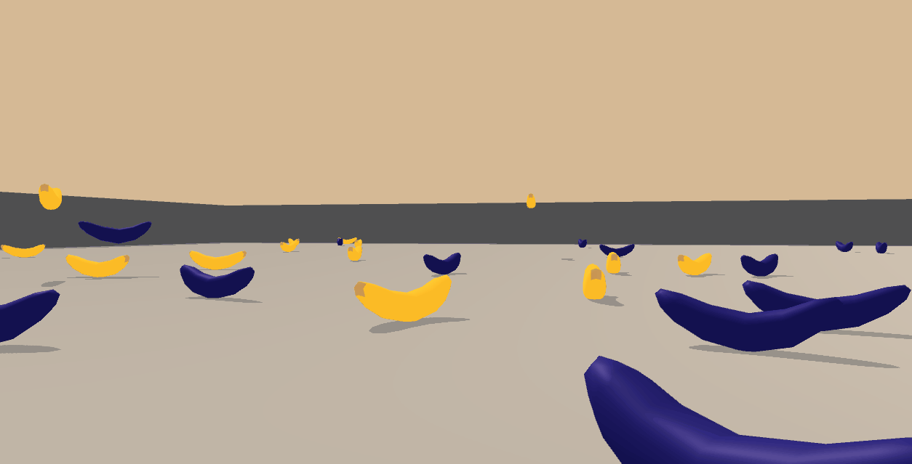

# Collecting Bananas

In this subproject, an agent is trained collect bananas in a large, square world by using 
__Deep-Q-Learning__.  
 

 

## The Environment

A reward of +1 is provided for collecting a yellow banana, and a reward of -1 is provided for collecting a blue banana. 
Thus, the goal of the agent is to collect as many yellow bananas as possible while avoiding blue bananas.

The state space has 37 dimensions and contains the agent's velocity, along with ray-based perception of objects around 
the agent's forward direction. Given this information, the agent has to learn how to best select actions. Four discrete
 actions are available, corresponding to:

- **`0`** - move forward.  
- **`1`** - move backward.  
- **`2`** - turn left.  
- **`3`** - turn right.  

The task is episodic, and in order to consider the environment solved, the agent needs to achieve an average score of 
+13 or higher over 100 consecutive episodes.

## Setup: Download the Unity Environment
For this subproject, you will not need to install Unity - the environment is pre-built and can be downloaded from one of 
the links below. You also need to perform the steps described in section "Getting Started" of the main README.md.

- Linux: [click here](https://s3-us-west-1.amazonaws.com/udacity-drlnd/P1/Banana/Banana_Linux.zip)
- Mac OSX: [click here](https://s3-us-west-1.amazonaws.com/udacity-drlnd/P1/Banana/Banana.app.zip)
- Windows (32-bit): [click here](https://s3-us-west-1.amazonaws.com/udacity-drlnd/P1/Banana/Banana_Windows_x86.zip)
- Windows (64-bit): [click here](https://s3-us-west-1.amazonaws.com/udacity-drlnd/P1/Banana/Banana_Windows_x86_64.zip)

Create the directory ./collecting_bananas/environment, place the unzipped content inside this folder and set the 
variable BANANA_PATH (defined in training.ipynb and evaluation.ipynb) as path to Banana.exe inside the environment 
folder.