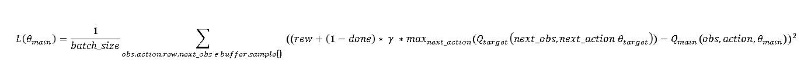
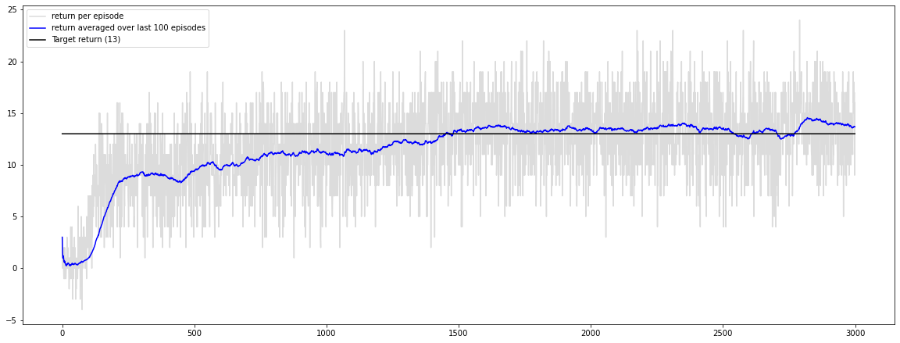

# Design Choices
The following provides a quick explanation of the project stucture and implementation choices.
We used Deep-Q-Learning. For more information on DQN, please refer to this [link.](https://towardsdatascience.com/self-learning-ai-agents-part-ii-deep-q-learning-b5ac60c3f47).

## High Level Structure

Basically, the whole project consists of two interacting objects: an agent and an environment.  
The agent decides how to act based on the current situation (observation) it finds itself in.  
The chosen action is given to the environment which in turn provides the agent with a reward for
its last action, a new observation and an indicator whether the episode has ended.

## Replay Buffer
During each timestep, the current (observation, action, reward, next_observation, done)-tuple is 
stored inside the Replay Buffer. Doing this, we are able to randomly sample such tuples from experience
and use those tuples to train the estimators. We do this mainly for two reasons:
1. Sampling from experience increases the sample efficiency.
2. Randomly sampling experience breaks dependency of (observation, action, reward, next_observation, done)-tuples
   and therefore stabilizes training of the estimator.
   
## Estimators
The agent decides on which action to choose by using a Neural Network (Main Network) to estimate the expected long term
return of each action - given the current observation - and picking the action with the highest expected value.
The Main Network is trained at each timestep with regard to the loss function  
 
  
 
where Qmain / Qtarget represent the Main Network / Target Network, respectively. The 
(obs, action, rew, next_obs, done)-tuples are sampled from the Replay Buffer. The Main and Target Network are identical 
at initialization. Training is only applied to the Main Network. At each timestep, a soft update towards the Main Network
is applied to the Target Network. Using this target network as a decoupled, more stationary target estimator introduces 
further stability.

## Soft Update

During experimentation it became obvious that hard, periodical updates of the target network leads to training 
instability. As a consequence, soft updates were implemented. At each timestep, the Target Network weights
are update towards the Main Network weights like this:
 

 

where tau is a tuneable hyperparameter.

## Exploration

At each timestep, the agent randomly picks an action with a probability epsilon. This encourages going new ways from
time to time. The agent starts with a high epsilon (i.e. probability of acting randomly) and linearly decreases
epsilon (i.e. exploration) at each timestep.

## Hyperparameters

For the achieved results described below, the following hyperparameters have been used in config.yml.

- observation_dim: 37
- action_dim: 4
- seed: 42
- buffer_size: 500000
- min_buffer_size: 50000
- layers:
    - fc1: 32
    - fc2: 32
- batch_size: 64
- epsilon: 1
- min_epsilon: 0.1
- epsilon_decay_period: 50000
- gamma: 0.99
- learning_rate: 10e-5
- update_period: 30000
- tau: 2e-3

## Results

For the given configuration, the following training results have been achieved over
3000 episodes.  
 

   
The used Q-Network is a two layer, fully connected Neural Network with 32 hidden units in each layer, activated by ReLu. 
The output layer is a four-dimensional linear function where the n-th output corresponds to the Q-Value of the n-th action.

## Ideas for Improvement
- Increasing the number of training steps during each timestep might increase sample efficiency.
- Implementing Double-Deep-Q-Learning or Dueling-Deep-Q-Networks might very likely increase stability by tackling 
   overestimation bias and providing a critic as a baseline. For more information, follow
    [this](https://towardsdatascience.com/double-deep-q-networks-905dd8325412) or this
     [link](https://towardsdatascience.com/dueling-deep-q-networks-81ffab672751).
