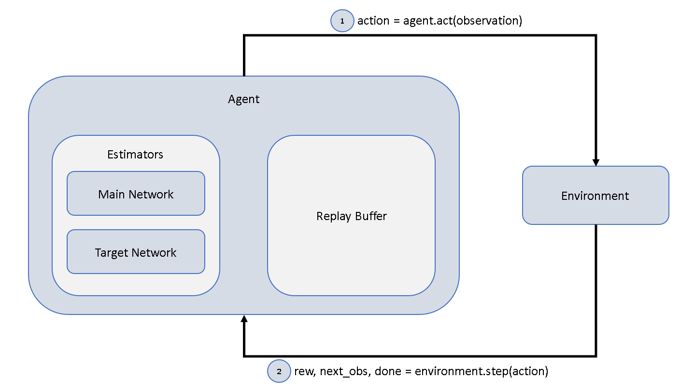

# Design Choices
The following provides a quick explanation of the project stucture and implementation choices.
We will use Q-Learning. For more information on DQN, please refer to this [link.](https://towardsdatascience.com/self-learning-ai-agents-part-ii-deep-q-learning-b5ac60c3f47).

## High Level Structure

Basically, the whole project consists of two interacting objects: an agent and an environment.  
The agent decides how to act based on the current situation (observation) it finds itself in.  
The chosen action is given to the environment which in turn provides the agent with a reward for
his last action, a new observation and an indicator, if the episode has ended.

## Replay Buffer
During each timestep, the current (observation, action, reward, next_observation, done)-tuple is 
stored inside the replay buffer. Doing this, we are able to randomly sample such tuples from experience
and use those tuples to train the estimators. We do this mainly for two reasons:
1. Sampling from experience increases the sample efficiency.
2. Random Sampling of experience breaks dependency of (observation, action, reward, next_observation, done)-tuples
   and therefore stabilizes training of the estimator.
   
## Estimators
The agent decides on which action to choose by using a Neural Network (Main Network) to estimate the expected reward of each
action given the current observation and picking the action with the highest expected value.
The Main Network is trained at each timestep with regard to the loss function  
 
  
 
where Qmain / Qtarget represent the Main Network / Target Network, respectively. The 
(obs, action, rew, next_obs, done)-tuples are sampled from the Replay Buffer. The Main and Target Network are identical 
at initialization. Training is only applied to the Main Network. At each timestep, a soft update towards the Main Network
is applied to the Target Network.

## Soft Update
During experimentation it became obvious that hard updates of the target network after a certain update period
leads to training instability. Because of that, soft updates were implemented. At each timestep, the Target Network weights
are update towards the Main Network weights like this:
 

 

where tau is a tuneable hyperparameter.

## Ideas for Improvement
- Increasing the number of training steps during each timestep might increase sample efficiency.
- Implementing Double-Deep-Q-Learning or Dueling-Deep-Q-Networks might increase stability by providing a critic as 
   baseline. For more information, follow this [link]().
