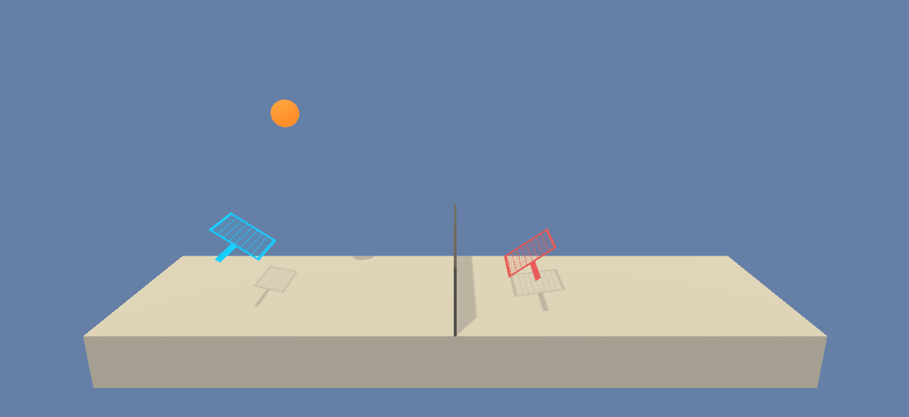

# Playing Tennis

In this subproject, two agents are trained to play tennis by using __Multi Agent Learning__ and
__Twin Delayed Deep Deterministic Policy Gradient (TD3)__.  
 

 

## The Environment

In this environment, two agents control rackets to bounce a ball over a net. If an agent hits the ball over the net, 
it receives a reward of +0.1. If an agent lets a ball hit the ground or hits the ball out of bounds, it receives a 
reward of -0.01. Thus, the goal of each agent is to keep the ball in play.

The observation space consists of 8 variables corresponding to the position and velocity of the ball and racket. 
Each agent receives its own, local observation. Two continuous actions are available, corresponding to movement toward 
(or away from) the net, and jumping.

The task is episodic and in order to solve the environment, the agents must get an average score of +0.5 
(over 100 consecutive episodes, after taking the maximum over both agents).  

Specifically,

- after each episode, the rewards that each agent received are added up (without discounting) to get a score for each 
   agent. This yields 2 (potentially different) scores. Then, the maximum of those two scores is taken.
   This yields a single score for each episode.
- The environment is considered solved as soon as the average (over 100 episodes) of those scores is at least +0.5.

## Setup: Download the Unity Environment
For this subproject, you will not need to install Unity - the environment is pre-built and can be downloaded from one of 
the links below. You also need to perform the steps described in section "Getting Started" of the main README.md.

- Linux: [click here](https://s3-us-west-1.amazonaws.com/udacity-drlnd/P3/Tennis/Tennis_Linux.zip)
- Mac OSX: [click here](https://s3-us-west-1.amazonaws.com/udacity-drlnd/P3/Tennis/Tennis.app.zip)
- Windows (32-bit): [click here](https://s3-us-west-1.amazonaws.com/udacity-drlnd/P3/Tennis/Tennis_Windows_x86.zip)
- Windows (64-bit): [click here](https://s3-us-west-1.amazonaws.com/udacity-drlnd/P3/Tennis/Tennis_Windows_x86_64.zip)

Create the directory ./playing_tennis/environment, place the unzipped content inside this folder and set the 
variable TENNIS_PATH (defined in training.ipynb and evaluation.ipynb) as path to Tennis.exe inside the environment 
folder.