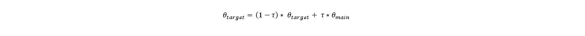

# Design Choices
The following provides a quick explanation of the project structure and implementation choices.
We used Multi Agent Learning combined with Twin Delayed Deep Deterministic Policy Gradient (TD3). For more information 
on Deep Deterministic Policy Gradient (DDPG) (the predecessor and also available in agents.py) and TD3, click 
[here (DDPG)](https://towardsdatascience.com/deep-deterministic-policy-gradients-explained-2d94655a9b7b)
or here [here (TD3)](https://towardsdatascience.com/td3-learning-to-run-with-ai-40dfc512f93).

## High Level Structure

Basically, the whole project consists of three interacting objects: two agents and an environment.  
Each agent decides independently of the other how to act based on the current situation (observation) it finds itself in.  
The chosen actions are given to the environment which in turn provides each agent with a reward for its last action, 
a new observation and an indicator whether the episode has ended.  

To solve the environment, the agents must learn to collaborate.

## Replay Buffer
The agents share a common Replay Buffer. As a consequence, both learn from the same experience.
During each time step, each agent stores its current (observation, action, reward, next_observation, done)-tuple
inside the Replay Buffer. Doing this, each agent is able to randomly sample such tuples from the shared experience
and use those tuples to train its estimators. We do this mainly for two reasons:
1. Sampling from experience increases the sample efficiency.
2. Randomly sampling experience breaks interdependency of (observation, action, reward, next_observation, done)-tuples
   and therefore stabilizes training of the estimators.
   
## Estimators

Inside each Agent, four Neural Networks are put to work:
1. Main Actor  
   This is used to map a given observation to an action.
2. Main Critic  
   A two-headed Neural Network - each head is used to predict the state-action value of a given state-action pair.
   The heads will be called Main Critic 1 and Main Critic 2.
3. Target Actor  
   The Target Actor is a delayed and trailing copy of the Main Actor. It is used to compute the target values during
   updates.
4. Target Critic  
   Analogous to the Target Actor. The heads will be called Target Critic 1 and Target Critic 2.
   
During each time step, a batch is sampled from the Replay Buffer.  
Using this batch, the critic of each Agent is updated with respect to the following loss:  
 

 

where the targets are computed as  
 

 

A represents the Actors, Q represents the Critics and done is a binary indicator whether the episode terminated
after the given sample observation.

During every second time step, each Agent's actor is also updated with respect to the loss  
 

 

This is equivalent to updating an Actor in such a way that it maximizes the state-action-value (with respect to the 
current Main Critic's estimates).

In the used configuration, each Actor is a three layer neural network with 32, 16, 16 hidden units, respectively.
Those hidden units are activated with ReLu. The output layer consists of 2 output units, activated with tanh.  
Each head of both Critics (Agent 1 and Agent 2) consists of two hidden layers, one with 32 and one with 16 hidden 
units, activated with ReLu, followed by a linear output layer of size 1.

## Soft Update

During each time step, the Target Critic's weights are updated towards those of the Main Critic using a soft update 
(see below). Every second time step, the Target Actor's weights are updated towards those of the Main Actor in the same 
way. Again, this applies for each Agent.  

The updates are performed using a soft update:
 

 

where each theta represents the weights of a Main / Target Network and tau is a tuneable hyperparameter.

## Exploration

After predicting the action, each Agent adds some noise to its action to cause exploration.
The noise is sampled from an Ornstein-Uhlenbeck-Process. In simple terms, this is just normal distributed noise, 
but biased towards the mean over time. More information on the Ornstein-Uhlenbeck-Process can be found 
[here](https://en.wikipedia.org/wiki/Ornstein%E2%80%93Uhlenbeck_process).

## Hyperparameters

For the achieved results described below, the following hyperparameters have been used (for each Agent):

- shared_config:  
   - observation_dim: 24
   - action_dim: 2  
 
- buffer_config:  
   - buffer_size: 500000  
   - min_buffer_size: 100000  
 
- actor_config:
   - layers:  
      - fc1: 32  
      - fc2: 16  
      - fc3: 16 

- critic_config:
   - layers:
      - fc1: 32
      - fc2: 16

- agent_config:
   - action_high: 1.0  
   - action_low: -1.0  
   - batch_size: 128  
   - gamma: 0.99  
   - actor_learning_rate: 5e-4  
   - critic_learning_rate: 5e-5  
   - action_noise_std: 0.1  
  - tau: 1e-4  

- ou_config:
   - mu: 0.0
   - theta: 0.2
   - max_sigma: 0.2
   - min_sigma: 0.1
   - decay_period: 1000

## Results

For the given configuration, the following training results have been achieved over 20000 episodes.  
 

 

We also ran the trained agents after deactivating exploration and achieved the following results during evaluation.  
 

 

## Ideas for Improvement
- Because of the Multi-Agent-Structure, training was highly instable from time to time. As can be seen above, the 
   trained agents were able to achieve an average return of > 2.4 over 100 episodes after deactivating exploration. This 
   is despite the fact that during training this score hardly crossed 1.0. Therefore, we conclude that experimenting with 
   decreasing exploration over episodes might be worth a shot.