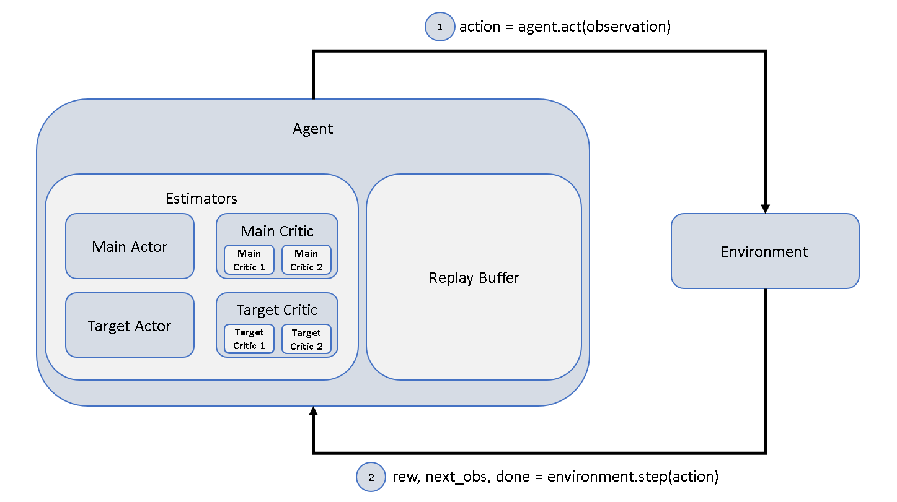
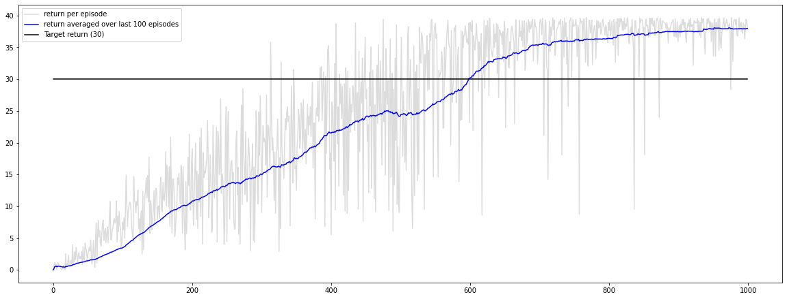

# Design Choices
The following provides a quick explanation of the project structure and implementation choices.
We used Twin Delayed Deep Deterministic Policy Gradient (TD3). For more information on Deep Deterministic Policy 
Gradient (DDPG) (its predecessor and also available in agents.py) and TD3, click 
[here (DDPG)](https://towardsdatascience.com/deep-deterministic-policy-gradients-explained-2d94655a9b7b)
or here [here (TD3)](https://towardsdatascience.com/td3-learning-to-run-with-ai-40dfc512f93).

## High Level Structure

Basically, the whole project consists of two interacting objects: an agent and an environment.  
The agent decides how to act based on the current situation (observation) it finds itself in.  
The chosen action is given to the environment which in turn provides the agent with a reward for
its last action, a new observation and an indicator whether the episode has ended.

## Replay Buffer
During each time step, the current (observation, action, reward, next_observation, done)-tuple is 
stored inside the Replay Buffer. Doing this, we are able to randomly sample such tuples from experience
and use those tuples to train the estimators. We do this mainly for two reasons:
1. Sampling from experience increases the sample efficiency.
2. Randomly sampling experience breaks interdependency of (observation, action, reward, next_observation, done)-tuples
   and therefore stabilizes training of the estimator.
   
## Estimators

Four Neural Networks are put to work:
1. Main Actor  
   This is used to map a given observation to an action.
2. Main Critic  
   A two-headed Neural Network - each head is used to predict the state-action value of a given state-action pair.
   The heads will be called Main Critic 1 and Main Critic 2.
3. Target Actor  
   The Target Actor is a delayed and trailing copy of the Main Actor. It is used to compute the target values during
   updates.
4. Target Critic  
   Analogous to the Target Actor. The heads will be called Target Critic 1 and Target Critic 2.
   
During each time step, a batch is sampled from the Replay Buffer.  
Using this batch, the critic is updated with respect to the following loss:  
 

 

where the targets are computed as  
 

 

A represents the Actors, Q represents the Critics and done is a binary indicator whether the episode terminated
after the given sample observation.

During every second time step, the actor is also updated with respect to the loss  
 

 

This is equivalent to updating the actor in such a way that it maximizes the state-action-value (with respect to the 
current Main Critic's estimates).

## Soft Update

During each time step, the Target Critic's weights are updated towards those of the Main Critic using a soft update 
(see below). Every second time step, the Target Actor's weights are updated towards those of the Main Actor in the same 
way.  

These updates are performed using a soft update:
 

 

where each theta represents the weights of a Main / Target Network and tau is a tuneable hyperparameter.

## Exploration

After predicting the action, some noise is added to the action to cause exploration.
The noise is sampled from an Ornstein-Uhlenbeck-Process. In simple terms, this is just normal distributed noise, 
but biased towards the mean over time. More information on the Ornstein-Uhlenbeck-Process can be found 
[here](https://en.wikipedia.org/wiki/Ornstein%E2%80%93Uhlenbeck_process).

## Hyperparameters

For the achieved results described below, the following hyperparameters have been used in config.yml.

- shared_config:  
   - observation_dim: 33  
   - action_dim: 4  
 
- buffer_config:  
   - buffer_size: 500000  
   - min_buffer_size: 100000  
 
- actor_config:
   - layers:  
      - fc1: 128  
      - fc2: 64  
      - fc3: 32 

- critic_config:
   - layers:
      - fc1: 64
      - fc2: 32

- agent_config:
   - action_high: 1.0  
   - action_low: -1.0  
   - batch_size: 128  
   - gamma: 0.99  
   - actor_learning_rate: 5e-4  
   - critic_learning_rate: 5e-5  
   - action_noise_std: 0.1  
  - tau: 1e-4  

- ou_config:
   - mu: 0.0
   - theta: 0.2
   - max_sigma: 0.2
   - min_sigma: 0.1
   - decay_period: 1000

## Results

For the given configuration, the following training results have been achieved over 1000 episodes.  
 

   

## Ideas for Improvement
- Going one step further and using distributed learning by implementing Distributed Distributional Deep Deterministic
   Policy Gradient (D4PG). For more information on D4PG, follow [this.](https://arxiv.org/pdf/1804.08617.pdf)
- Adding a tiny negative reward that is indirectly correlated to the magnitude of the summed up absolute values of the 
   chosen actions at each time step. This could encourage more efficient and elegant movement.